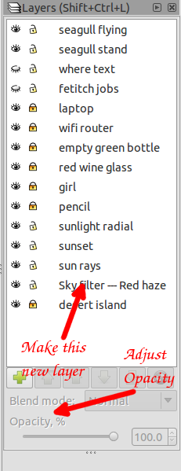

# inkscape-kids-tutorial-sundown-sky

Teach kids how to use inkscape. Take a non-svg background image of sunrise and make it sunset

 


## How we'll change sunrise to sunset

- Make a new layer above the sunrise layer
- draw a rough rectangle over the entire sky and part of the waves
- draw a 2nd shape and use that to cut out the parts of the rectange we don't want
- Keep doing this until we cut out: the palm tree and everything below the waves. But not the clouds or anything in hidden layers

## What tools we'll use

 

* **Eye dropper**  When we cut out too much, used to grab sky color. Can then make a patch of the same color

* **Draw Bezier curves** Used to make patches

* **Create rectangles** Used to make the sky (filter) rectangle 

* **Edit paths by nodes** Used to see both the sky and patches nodes. Think of this as `nodes mode`

### Adjust zoom and color


Find this at the bottom right corner of the app window

### Layers (docked window) and Opacity



Open using either:

- From menu, Layers->Layers

- Ctrl+Shift+L

Working in a layer keeps the other layers safe

Opacity and transparency means the same thing, how much can see through the top layer. We left the Opacity at 100%

To adjust the Opacity

1. Click to select the layer

1. Move Opacity slider to desired amount

### Modifying a path

- Use (Path) `Difference` between two objects to cut piece out of the first object. We make a patch. And use the patch to tear a that piece out of the sky rectangle
- Use (Path) `Union` to make repairs. When we cut too much out


### Working with paths

Change object -> path. From menu, Path->Object to Path. We are mainly working with path, not an object. Only exception, when needing to [fix a mistake](https://github.com/grummerd/inkscape-kids-tutorial-sundown-sky#undo-mistakes "fixing mistakes")

## Duration
A kid should be able to complete this tutorial, with the assistance of a teacher, within 30 minutes to an 1 hour. Teacher should show a kid once or twice and then let them repeat cutting out pieces from the rectangle. Don't worry if the kid can't complete it to perfection.

## What's the point??
**The point is to burn into muscle memory how to:**

- combine two objects
- Use a 2nd object to cut pieces from the another object

## Why is it important to teach kids computers?

School primarily focuses on: 1-2 languages, gym, and math. With a piece of paper in hand, graduates are thrown out into the real world functionally illiterate. Lets teach our kids computer proficiency as early as possible

---

# Sky Filter Tutorial

Makes a filter/mask which can be adjusted. Used to darken the layer beneath

## Initial settings

1. Lower right of main window, change zoom to 400%. This will help improve drawing accuracy. Click the number `5` key to see the entire canvas. Now return Zoom to 400%

## Layers setup

1. Open `Layers` docked window. Layers->Layers or Shift+Crtl+L

1. From `pencil` layer on up, click the eyeball icon to hide those layers

1. Click on `desert island` layer. Add a new layer (click plus `+` icon). Name it `Sky filter -- Red Haze`. Place it `Above current`

## Create Sky filter

1. Add new `recentanges and squares` object, cover the entire sky area and a little below the ocean waves

    ```
From here on out, we'll call this rectange, `sky filter`
    ```

1. Change the color of `sky filter` to #D40000 (a dark red). This will give a red hazy color to the sky

1. From Layers docked window, adjust the Opacity % as desired. We used 100

1. Convert sky filter rectange from an object to a path. Path->Object to Path

## Removing portions of `Sky filter`

We will repeat this many times. To remove pieces from the sky filter rectangle until the palm tree, beneath the waves, and the curves border are all removed 

### Draw the 2nd shape

1. Using `Draw Bezier curves and straight lines` tool. We want to take a chunk out of below the ocean waves. Draw a small modest shape using the Bezier curves tool. So now you'll have two objects: a rectangle covering the entire sky and a small shape. We'll call this small object, `2nd shape`

### Use 2nd shape to cut piece out of `sky filter`

1. Click on `Edit paths by nodes` tool or press F2. You are now looking at objects' path, not the object

1. Click on the `2nd shape`. Shift+left click on `sky filter` rectangle. From menu, Path->Difference

    ```
    A piece of the sky filter rectangle should now be gone. The 2nd shape is gone
    ```

## Repeat many times

Teacher cuts out two pieces from the sky filter rectangle. Afterwards the student takes over. The teacher then takes the student thru the process step by step. Letting the student do all the clicking and/or typing. Continue until the student is confident enough to do the rest. 10-20 cuts from the sky filter rectangle should be enough

## Undo mistakes

Even at 400% zoom, mistakes will be made. Cutting to little isn't a problem. What if we cut too much. An option is undo (Ctrl+z). Another option is making a patch (and hope no one notices)

1. Make a `2nd shape` over the portion which got removed too much
1. From the `2nd shape`, remove it's border color. Crtl+Shift+F opens the Fill and Stroke (docked) window. In the stroke paint tab, click `X` (no paint). This will turn off the border
1. Using the eye dropper tool (F7) take the color from the sky rectangle. Then change the `2nd shapes` color to be the same
1. Select both objects. Click on `Edit path by nodes` (F2), click `2nd shape`, Shift+Left Click sky filter rectangle. Now both objects should be selected. From the menu choose Path->Union. The patch should now have been applied. The missing piece is no longer missing. Phew ;-)
